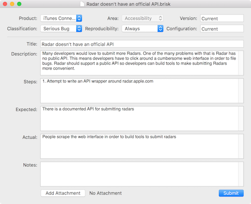

# Brisk


Brisk is a macOS app for filing [Radars](http://radar.apple.com) and
optionally crossposting them to [Open Radar](http://www.openradar.me/).

Brisk is written in Swift and uses
[Sonar](https://github.com/br1sk/Sonar) to communicate with Apple's
Radar web "APIs".

Brisk supports two factor auth, attachments, and saving radars as
drafts.



## Installation

There are a few different ways you can install Brisk:

1. Download the latest packaged `Brisk.app` from [the
   releases](https://github.com/br1sk/brisk/releases) and copy it to
   your Applications directory
1. Using [brew-cask](https://github.com/caskroom/homebrew-cask) with
   `brew install --cask brisk`
1. Clone the repo and run `make install`

## Development

Build Brisk locally:

```sh
$ make build
```

To just install the dependencies, and then build in Xcode:

```sh
$ make dependencies
$ open -a Xcode .
```

To build and install Brisk to your `/Applications` directory:

```sh
$ make install
```

## Credits

Anteater icon by [Samantha Broccoli](http://www.samanthabroccoli.com)
from [Raizlabs](https://www.raizlabs.com).
